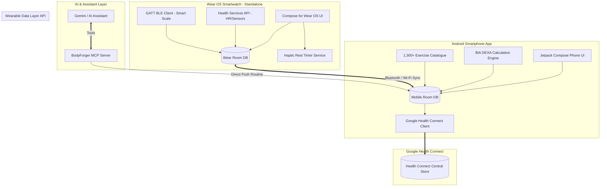

# ⚡ BodyForger

<div align="center">

### **The All-in-One, Offline-First, Wrist-First Gym & Body Composition Suite**
*Autonomous Wear OS Engine • 1,300+ Exercise Core • Clinical BIA Body Composition • Direct BLE Scales • Google Health Connect & MCP AI Sync*

[](#)
[](#)
[](#)
[](#)
[](#)
[](#)

</div>

---

## 🌟 Vision & Overview

**BodyForger** is an ecosystem built for athletes who want complete control over their training data, body composition, and workout execution.

Most existing fitness solutions (like Hevy, Strong, or MyFitnessPal) suffer from:
* Clunky or dependent smartwatch companion apps that disconnect or freeze when the screen dims.
* Fragmented tracking: workouts in one app, scale measurements in another, tape logs in a third.
* Poor or delayed synchronization with **Google Health Connect**.
* Inability to let modern AI assistants (like Gemini) inspect body composition and push tailored routines directly into the app.

BodyForger combines the **clinical BIA analysis and BLE scale drivers** of *SimpleBodyGraph*, the **1,300+ exercises and advanced set mechanics** of *openGym*, and a **100% autonomous Wear OS engine** with full **Google Health Connect & MCP AI** interoperability.

---

## 🏗️ The 4 Core Pillars

```
+---------------------------------------------------------------------------------------+
|                                      BodyForger                                       |
+-----------------------+-------------------------------+-------------------------------+
|  1. WRIST-FIRST WEAR  |  2. CLINICAL BIA & SCALES     |  3. ADVANCED WORKOUT CORE     |
|  - Health Services    |  - HUAWEI Scale 3 + Standard  |  - 1,300+ Exercises (openGym) |
|  - Continuous HR      |  - DEXA BIA 8-Electrode Model |  - Drop-Sets & Rest-Pause     |
|  - Ambient / Screen-Off| - Tape Measurements          |  - Heatmap, Volume & 1RM      |
|  - Rest Haptics       |  - Milestone Paliers          |  - Routine & Split Builder    |
+-----------------------+-------------------------------+-------------------------------+
|                               4. GOOGLE HEALTH & AI ECOSYSTEM                         |
|   PlannedExerciseSessionRecord • ExerciseSessionRecord (HR series) • MCP Routine Sync |
+---------------------------------------------------------------------------------------+
```

### ⌚ 1. Wrist-First Autonomous Wear OS App
* **True Standalone Operation**: Train without your phone nearby. Workouts are logged locally in Room DB and synced asynchronously via the Wearable Data Layer API upon reconnection.
* **Health Services API**: Uses Android Health Services (`ExerciseClient`) to track real-time heart rate (BPM) and active calories on the low-power sensor coprocessor.
* **Flawless Screen-Off / Ambient Mode**: Optimized `AmbientLifecycleObserver` display (pure black, 1 Hz refresh) keeps active workouts and rest countdowns running without OS battery termination.
* **Haptic Rest Timers**: Custom vibration patterns (warning pulses at -3s, strong finish burst) to signal set readiness eyes-free.
* **Rotary Dial & Quick Entry**: Rapid weight, reps, and RPE logging optimized for small circular screens.
* **Direct On-Watch BLE Scale Weigh-In**: Connect directly to Bluetooth scales via GATT client from the watch.

### 🧬 2. Clinical Body Composition & BLE Scales (SimpleBodyGraph Heritage)
* **Direct BLE Scale Drivers**: Native GATT driver registry supporting proprietary scales (HUAWEI Scale 3 / 3 Pro with cryptographic handshake) and standard Bluetooth Weight Scale (`0x181D`).
* **DEXA-Calibrated BIA Modeling**:
  * Total Mass, Fat Mass (kg), Body Fat (%), Lean Body Mass (FFM), Skeletal Muscle Mass (SMM), Bone Mineral Content.
  * Hydration: Total Body Water (TBW), Extracellular (ECW), Intracellular (ICW), ECW/TBW ratio.
  * Somatotype classification, Visceral Fat Level (VFL), BMR, Metabolic Age, Health Score.
  * 5-Zone Segmental Breakdown: Trunk, Left/Right Arms, Left/Right Legs.
* **Morphological Tape Tracking**: Circumference logs (Chest, Waist, Biceps, Thighs) with dynamic trend graphs.
* **Milestone Paliers**: Automated goal validation based on 7-day rolling median trends.

### 🏋️ 3. Strength & Routine Engine (openGym Heritage)
* **1,300+ Exercise Library**: Muscle tags, equipment filters, step-by-step instructions, and execution animations.
* **Advanced Set Modeling**:
  * Straight work sets & Warmups.
  * Drop-sets with automated percentage weight reductions.
  * Rest-pause & Myo-reps cluster breakdowns.
  * RPE (Rate of Perceived Exertion) and 1RM estimation (Epley/Brzycki).
* **Routine & Split Builder**: Push/Pull/Legs, Upper/Lower, Full Body, custom supersets.
* **Muscle Heatmap**: Visual anatomical map highlighting weekly stimulus and volume distribution.

### 🔄 4. Google Health Connect & MCP AI Sync
* **Planned Workouts**: Reads and writes **`PlannedExerciseSessionRecord`** (`WRITE_PLANNED_EXERCISE` / `READ_PLANNED_EXERCISE`) for seamless workout schedule interoperability.
* **Completed Session Telemetry**: Writes full **`ExerciseSessionRecord`** (`EXERCISE_TYPE_STRENGTH_TRAINING`, `CALISTHENICS`, etc.) paired with continuous **`HeartRateRecord`** time-series and active calories.
* **Model Context Protocol (MCP) Server**:
  * Connects directly to **Gemini**, Claude, or other LLMs.
  * Tools: `get_body_metrics()`, `search_exercises()`, `push_workout_routine()`.
  * AI assistants analyze user BIA evolution and generate personalized routine plans directly into the app.
* **Android Deep Linking**: `bodyforger://import/routine?payload=...` and native Android Share Sheet intent ingestion.

---

## 📐 System Architecture



---

## 🗂️ Project Structure

```
BodyForger/
├── app-mobile/                # Android Mobile Application (Jetpack Compose)
│   ├── src/main/kotlin/       # Screens: Dashboard, BIA Report, Workout, Routine Editor
│   └── build.gradle.kts
├── app-wear/                  # Wear OS Standalone Application (Compose for Wear OS)
│   ├── src/main/kotlin/       # Screens: Active Workout, Rest Timer, Weight Quick-Log
│   ├── services/              # ExerciseClient, OngoingActivityNotification, RestVibrator
│   └── build.gradle.kts
├── core-model/                # Shared Kotlin Data Models (Workout, Set, Exercise, BIA, Log)
├── core-database/             # Shared Room DB entities, DAOs, and migrations
├── core-ble/                  # BLE GATT drivers (Huawei Scale 3, Generic 0x181D)
├── core-bia/                  # DEXA BIA Mathematical Engine ported to Kotlin
├── core-healthconnect/        # Health Connect Read/Write Adapters (Sessions, Planned, Metrics)
├── core-sync/                 # Wearable Data Layer Sync Engine
├── server-mcp/                # Model Context Protocol Server for Gemini / AI routines
├── exercises-data/            # 1,300+ Exercise dataset (JSON & animations)
└── README.md
```

---

## 🚀 Roadmap

- [x] **Phase 0**: Architecture & repository initialization as **BodyForger**.
- [ ] **Phase 1**: Port BIA Engine & Scale 3 BLE Driver to Kotlin Android/Wear module.
- [ ] **Phase 2**: Import openGym exercise database (1,300+ exercises) & workout models into `core-model`.
- [ ] **Phase 3**: Build standalone Wear OS workout runner (Health Services HR + Ambient AOD + Haptics).
- [ ] **Phase 4**: Wearable Data Layer bidirectional synchronization (Watch ↔ Phone).
- [ ] **Phase 5**: Google Health Connect exporter (Completed Sessions, HR series, Planned Exercises).
- [ ] **Phase 6**: BodyForger MCP Server for Gemini workout generation.
- [ ] **Phase 7**: UI Polish (Neon glow charts, muscle heatmap, rotary dial controls).
