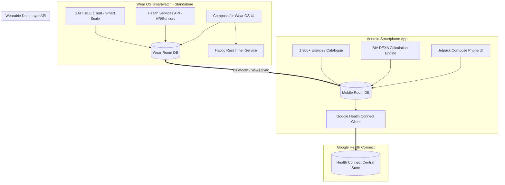

# ⚡ NexusFit (Working Title)

<div align="center">

### **The All-in-One, Offline-First, Wrist-First Fitness & Body Composition Ecosystem**
*Workout Tracking • Autonomous Wear OS Engine • Clinical BIA Body Composition • Direct BLE Scales • Google Health Connect*

[](#)
[](#)
[](#)
[](#)
[](#)

</div>

---

## 🌟 Vision & Overview

**NexusFit** is an all-in-one health and strength ecosystem that eliminates the fragmentation between workout trackers, body composition monitors, and wearable hardware. 

Existing solutions (like Hevy, Strong, or MyFitnessPal) suffer from:
* Clunky or dependent smartwatch companion apps that disconnect or freeze when the screen dims.
* Fragmented tracking: workouts in one app, scale measurements in another, body tape in a third.
* Poor, delayed, or incomplete synchronization with **Google Health Connect**.

NexusFit merges the **deep BIA analysis and BLE scale drivers** of *SimpleBodyGraph* with the **1,300+ exercises and advanced set mechanics** of *openGym*, powered by a **100% autonomous Wear OS engine**.

---

## 🏗️ The 4 Core Pillars

```
+-------------------------------------------------------------------------------+
|                                   NexusFit                                    |
+-----------------------+-------------------------------+-----------------------+
|  1. WRIST-FIRST WEAR  |  2. CLINICAL BIA & SCALES     |  3. ADVANCED WORKOUT  |
|  - Health Services    |  - HUAWEI Scale 3 + Standard  |  - 1,300+ Exercises   |
|  - Continuous HR      |  - DEXA BIA 8-Electrode Model |  - Drop-Sets & Myo    |
|  - Ambient / Screen-Off| - Tape Measurements          |  - Heatmap & 1RM      |
|  - Rest Haptics       |  - Milestone Paliers          |  - Routine Split      |
+-----------------------+-------------------------------+-----------------------+
|                       4. GOOGLE HEALTH CONNECT ENGINE                         |
|   ExerciseSessionRecord (with HR time-series) • WeightRecord • BodyFatRecord  |
+-------------------------------------------------------------------------------+
```

### ⌚ 1. Wrist-First Autonomous Wear OS App
* **True Standalone Capability**: Train with zero smartphone dependency. Workouts are logged locally in Room DB and synced asynchronously via Data Layer API upon reconnection.
* **Health Services API Integration**: Uses Android Health Services (`ExerciseClient`) to track real-time cardio (BPM) and active calories on the low-power sensor coprocessor without battery drain.
* **Flawless Screen-Off / Ambient Mode**: Optimized `AmbientLifecycleObserver` display (pure black, 1 Hz refresh) keeps the workout and rest countdown active without the OS killing the app.
* **Haptic Rest Timers**: Custom vibration sequences (warning pulses at -3s, strong finish burst) to alert the user even when eyes and screen are off.
* **Rotary Dial & Quick Entry**: Fast weight, reps, and RPE logging optimized for small circular screens.
* **Direct On-Watch BLE Scale Weigh-In**: Connect directly to Bluetooth scales from the watch GATT client.

### 🧬 2. Clinical Body Composition & BLE Scales (SimpleBodyGraph Engine)
* **Direct BLE Scale Drivers**: Native GATT driver registry supporting proprietary scales (HUAWEI Scale 3 / 3 Pro with cryptographic handshake) and standard Bluetooth Weight Scale (`0x181D`).
* **DEXA-Calibrated BIA Modeling**:
  * Total Mass, Fat Mass (kg), Body Fat (%), Lean Body Mass (FFM), Skeletal Muscle Mass (SMM), Bone Mineral Content.
  * Hydration: Total Body Water (TBW), Extracellular (ECW), Intracellular (ICW), ECW/TBW ratio.
  * Somatotype classification, Visceral Fat Level (VFL), BMR, Metabolic Age, Health Score.
  * 5-Zone Segmental Breakdown: Trunk, Left/Right Arms, Left/Right Legs.
* **Morphological Tape Tracking**: Circumference logs (Chest, Waist, Biceps, Thighs) with dynamic trend graphs.
* **Milestone Paliers**: Automated goal validation based on 7-day rolling median trends.

### 🏋️ 3. Strength & Routine Engine (openGym Heritage)
* **1,300+ Exercise Library**: Muscle tags, equipment filters, step-by-step instructions, and execution animations.
* **Advanced Set Modeling**:
  * Straight work sets & Warmups.
  * Drop-sets with automated percentage reductions.
  * Rest-pause & Myo-reps cluster breakdowns.
  * RPE (Rate of Perceived Exertion) and 1RM estimation (Epley/Brzycki).
* **Routine & Split Builder**: Push/Pull/Legs, Upper/Lower, Full Body, custom supersets.
* **Muscle Heatmap**: Visual anatomical map highlighting weekly stimulus and volume distribution.

### 🔄 4. Google Health Connect Deep Integration
* Writes full **`ExerciseSessionRecord`** (`EXERCISE_TYPE_STRENGTH_TRAINING`, `CALISTHENICS`, etc.).
* Stores continuous **`HeartRateRecord`** series mapped to the workout session.
* Syncs **`WeightRecord`**, **`BodyFatRecord`**, and **`ActiveCaloriesBurnedRecord`**.

---

## 📐 System Architecture



---

## 🗂️ Proposed Project Structure

```
NexusFit/
├── app-mobile/                # Android Mobile Application (Jetpack Compose)
│   ├── src/main/kotlin/       # Screens: Dashboard, BIA Report, Workout, Routine Editor
│   └── build.gradle.kts
├── app-wear/                  # Wear OS Standalone Application (Compose for Wear OS)
│   ├── src/main/kotlin/       # Screens: Active Workout, Rest Timer, Weight Quick-Log
│   ├── services/              # ExerciseClient, OngoingActivityNotification, RestVibrator
│   └── build.gradle.kts
├── core-model/                # Shared Kotlin Data Models (Workout, Set, Exercise, BIA, Log)
├── core-database/             # Shared Room DB entities, DAOs, and migrations
├── core-ble/                  # BLE GATT drivers (Huawei Scale 3, Generic 0x181D)
├── core-bia/                  # DEXA BIA Mathematical Engine ported to Kotlin
├── core-healthconnect/        # Health Connect Read/Write Adapters
├── core-sync/                 # Wearable Data Layer Sync Engine
├── exercises-data/            # 1,300+ Exercise dataset (JSON & assets)
└── README.md
```

---

## 🚀 Roadmap

- [x] **Phase 0**: Architecture & repository initialization.
- [ ] **Phase 1**: Port BIA Engine & Scale 3 BLE Driver to Kotlin multiplatform/Android module.
- [ ] **Phase 2**: Integrate openGym exercise database (1,300+ exercises) & workout models.
- [ ] **Phase 3**: Build standalone Wear OS workout runner (Health Services HR + Ambient AOD + Haptics).
- [ ] **Phase 4**: Wearable Data Layer bidirectional synchronization (Watch ↔ Phone).
- [ ] **Phase 5**: Google Health Connect exporter (Sessions, HR time-series, Weight, Body Fat).
- [ ] **Phase 6**: UI Polish (Neon glow charts, muscle heatmap, rotary dial controls).
