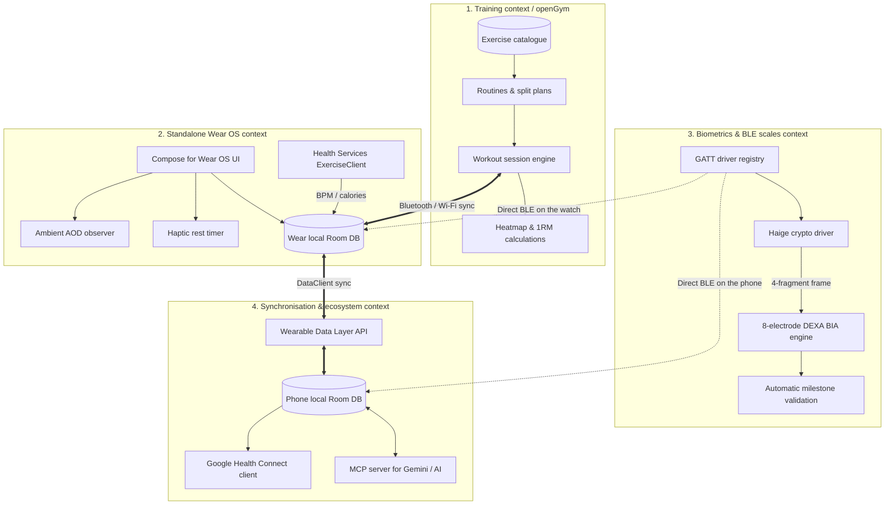
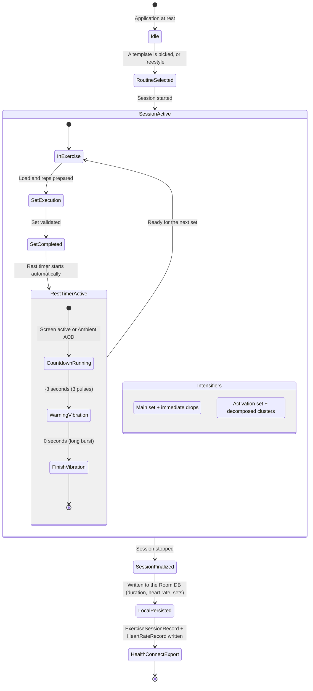
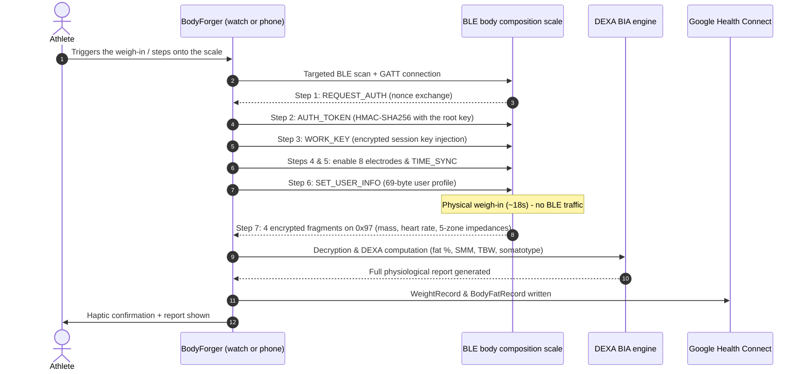
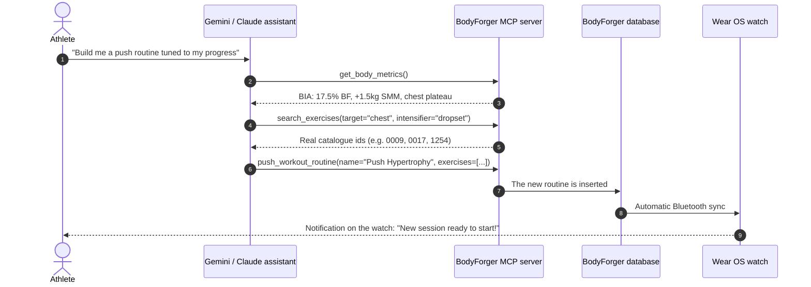

# 🗺️ BodyForger — Wayfinder & Architecture Map

This document maps every data flow, state machine and interaction between the contexts of the BodyForger ecosystem.

---

## 🧭 1. Topology of the Business Contexts

---

## ⚡ 2. State Machine: Running a Workout Session

---

## ⚖️ 3. State Machine: Connected BLE Weigh-In

---

## 🤖 4. AI Integration Flow (MCP Server)

---

## 🎯 5. Responsibilities by Module

| Module | Role & responsibility |
| :--- | :--- |
| `app-wear` | Wear OS interface, `Health Services` background service, always-on display (AOD) handling, haptic vibration. |
| `app-mobile` | Android phone interface, dashboard, dynamic neon charts, routine editor, BIA reports. |
| `core-model` | Immutable domain entities (`WorkoutSession`, `WorkoutSet`, `Exercise`, `BodyLog`, `BiaProfile`). |
| `core-database` | Shared Room DB persistence, DAOs, local migrations. |
| `core-bia` | Pure DEXA mathematical engine (body composition and water compartments). |
| `core-ble` | GATT driver registry (Haige family and Bluetooth standard). |
| `core-healthconnect` | Google Health Connect read/write adapter (`PlannedExercise`, `ExerciseSession`, `HeartRate`). |
| `server-mcp` | Model Context Protocol server for AI interoperability with Gemini. |
| `web` | Showcase site and documentation, deployed on Cloudflare Pages (`bodyforger.app`). |

---

## 📑 6. Index of Architecture Decisions (ADR)

* [**ADR 001: Offline Synchronisation Architecture, Wear OS Independence & Cloud Backup Strategy**](adr/001-offline-sync-wear-phone-cloud.md)
