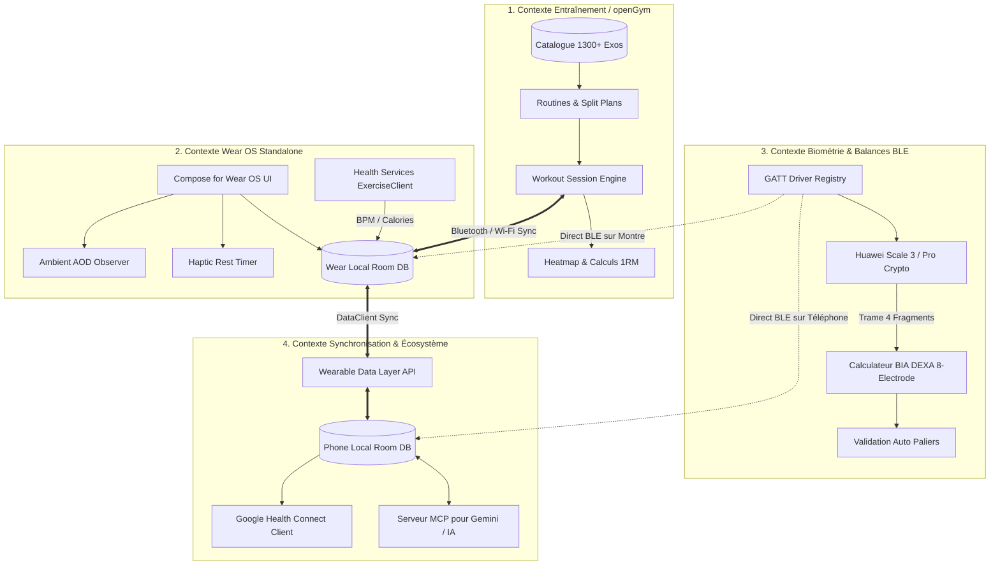
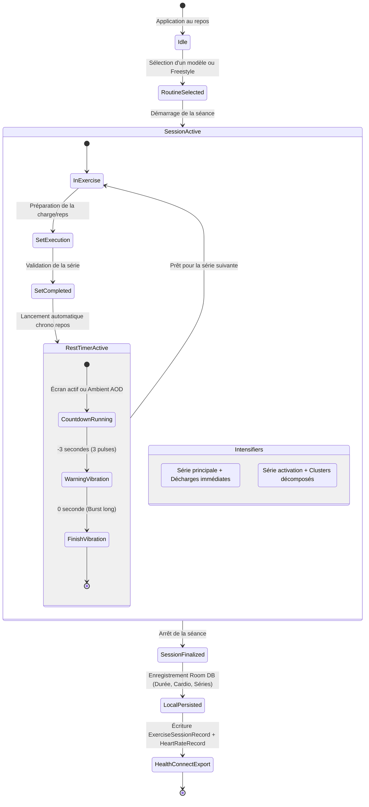
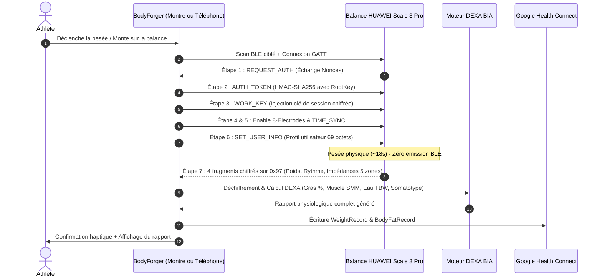
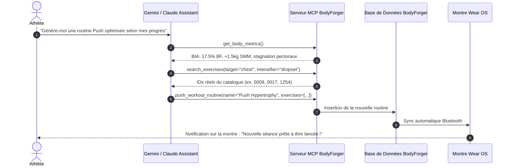

# 🗺️ BodyForger — Wayfinder & Architecture Map

Ce document cartographie l'ensemble des flux de données, machines à états et interactions entre les différents contextes de l'écosystème BodyForger.

---

## 🧭 1. Carte Topologique des Contextes Métier

---

## ⚡ 2. Machine à États : Déroulement d'une Séance (Workout Session)

---

## ⚖️ 3. Machine à États : Pesée Connectée BLE (Huawei Scale 3 / Pro)

---

## 🤖 4. Flux d'Intégration IA (Serveur MCP)

---

## 🎯 5. Résumé des Responsabilités par Module

| Module | Rôle & Responsabilité |
| :--- | :--- |
| `app-wear` | Interface Wear OS, Service d'arrière-plan `Health Services`, Gestion de l'affichage Always-On (AOD), Vibration haptique. |
| `app-mobile` | Interface Smartphone Android, Tableau de bord, Graphiques dynamiques néon, Éditeur de routines, Rapports BIA. |
| `core-model` | Entités de domaine immutables (`WorkoutSession`, `WorkoutSet`, `Exercise`, `BodyLog`, `BiaProfile`). |
| `core-database` | Persistance Room DB partagée, DAOs, migrations locales. |
| `core-bia` | Moteur mathématique pur DEXA (calculs de composition corporelle et compartiments hydriques). |
| `core-ble` | Registre des pilotes GATT (Huawei Scale 3 et standard Bluetooth). |
| `core-healthconnect` | Adaptateur de lecture/écriture Google Health Connect (`PlannedExercise`, `ExerciseSession`, `HeartRate`). |
| `server-mcp` | Serveur Model Context Protocol pour l'interopérabilité IA avec Gemini. |
| `web` | Site vitrine et documentation déployé sur Cloudflare Pages (`bodyforger.app`). |
