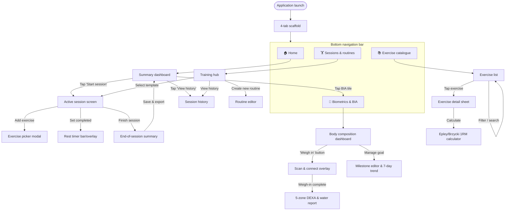
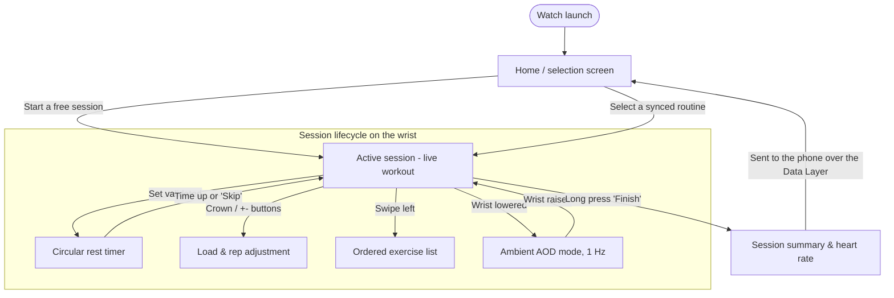

# 📱 BodyForger — Screen Wayfinder (UI Navigation & Interaction Map)

This document maps the complete navigation tree, the interface state machines and the interaction contracts for the **Mobile** (phone) and **Wear OS** (watch) applications.

---

## 🗺️ 1. Mobile Navigation Topology

---

## ⌚ 2. Wear OS Navigation Topology (Wrist-First)

---

## 📋 3. Detailed Screen Specification & Interaction Contracts

### 📱 Mobile screens (Android Jetpack Compose)

| Screen | Role | Input data | Actions / events raised |
| :--- | :--- | :--- | :--- |
| **`HomeScreen`** | Daily overview, motivation and quick access. | `UserStats`, `NextScheduledWorkout`, `LastBodyLog`. | `onStartWorkout()`, `onOpenBIA()`, `onViewHistory()`. |
| **`WorkoutScreen` (active)** | Driving the live session, with timer and live heart rate. | `ActiveWorkoutSession`, `LiveHeartRate`. | `onLogSet(weight, reps, type)`, `onAddExercise()`, `onFinishWorkout()`. |
| **`RoutineEditorScreen`** | Creating and editing session templates (split, PPL, upper/lower). | `Routine?` (when editing). | `onAddExercise()`, `onReorderExercises()`, `onSaveRoutine()`. |
| **`ExerciseDetailScreen`** | Execution guide, primary/secondary target muscles, 1RM history. | `exerciseId: String`. | `onAddToCurrentWorkout()`, `onCalculate1RM()`. |
| **`BiometricsScreen`** | Clinical body-composition analysis and BLE weigh-in. | `BiaProfile`, `List<BodyLog>`. | `onTriggerBLEScan()`, `onUpdateGoal()`, `onExportHealthConnect()`. |
| **`CatalogScreen`** | Explorer for the exercise catalogue, with instant search. | `SearchFilter(muscle, equipment)`. | `onSelectExercise()`, `onApplyFilter()`. |

---

### ⌚ Wear OS screens (Compose for Wear OS)

| Screen | Role | Specific interactions | Edge cases |
| :--- | :--- | :--- | :--- |
| **`WearLiveWorkoutScreen`** | Large-format display of the current set, with live heart rate. | • Giant `VALIDATE SET` button • Rotating crown to adjust the weight. | Screen lockable against sweat (`Water Lock`). |
| **`WearRestTimerScreen`** | Visual and haptic recovery countdown. | • Depleting circular ring • `+30s` and `SKIP` buttons. | Vibration continues even in deep sleep, via `AlarmManager.setAlarmClock()`. |
| **`WearAmbientScreen`** | Low-power always-on display at 1 Hz. | • Absolute black background, 100 % OLED • Minimal timer + BPM display. | Compose animations disabled to avoid burning CPU. |
| **`WearSummaryScreen`** | End-of-training summary on the wrist. | • Duration, average/max BPM, total volume (kg). | Persisted locally to Room immediately, before any Bluetooth sync attempt. |

---

## 🛡️ 4. Edge-Case Resolution Matrix

1. **Bluetooth link lost between watch and phone**:
   * *Behaviour*: watch and phone each carry on fully autonomously, writing to their own local Room database.
   * *Recovery*: synchronisation happens automatically on reconnection through `WearableDataLayerManager`, reconciled on UTC timestamps.
2. **Unexpected close or flat battery mid-session**:
   * *Behaviour*: every validated set is persisted transactionally to Room straight away (`atomic insert`).
   * *Recovery*: on restart, the application offers a *"Resume the session in progress"* button.
3. **BLE weigh-in interrupted (stepping off the scale early)**:
   * *Behaviour*: a safety timeout after 25 seconds if the four telemetry fragments do not arrive.
   * *User feedback*: a clear message — *"Incomplete weigh-in — stay still on the scale until the beep"*.
