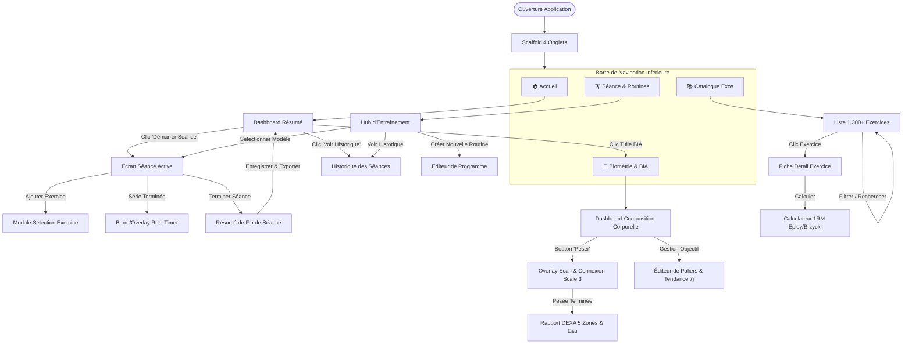
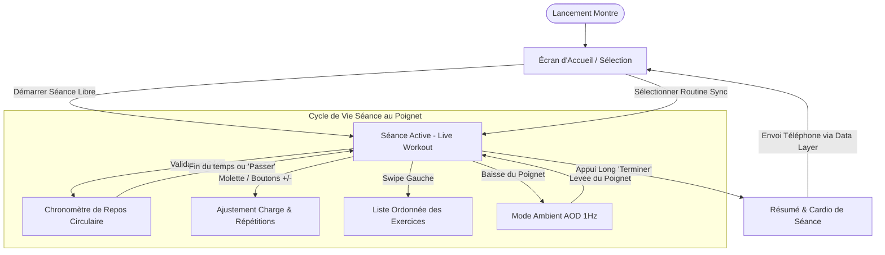

# 📱 BodyForger — Wayfinder des Écrans (UI Navigation & Interaction Map)

Ce document cartographie l'arbre de navigation complet, les machines à états d'interface et les contrats d'interaction pour l'application **Mobile** (Smartphone) et **Wear OS** (Montre).

---

## 🗺️ 1. Arbre Topologique de Navigation Mobile

---

## ⌚ 2. Arbre Topologique de Navigation Wear OS (Wrist-First)

---

## 📋 3. Spécification Détaillée des Écrans & Contrats d'Interaction

### 📱 Écrans Mobile (Android Jetpack Compose)

| Écran | Rôle Métier | Données en Entrée | Actions / Événements Déclenchés |
| :--- | :--- | :--- | :--- |
| **`HomeScreen`** | Vue d'ensemble quotidienne, motivation et accès rapide. | `UserStats`, `NextScheduledWorkout`, `LastBodyLog`. | `onStartWorkout()`, `onOpenBIA()`, `onViewHistory()`. |
| **`WorkoutScreen` (Active)** | Pilotage de la séance en direct avec chronomètre et cardio live. | `ActiveWorkoutSession`, `LiveHeartRate`. | `onLogSet(weight, reps, type)`, `onAddExercise()`, `onFinishWorkout()`. |
| **`RoutineEditorScreen`** | Création et édition de modèles de séances (Split, PPL, Upper/Lower). | `Routine?` (si édition). | `onAddExercise()`, `onReorderExercises()`, `onSaveRoutine()`. |
| **`ExerciseDetailScreen`** | Guide d'exécution, muscles cibles primaires/secondaires, historique 1RM. | `exerciseId: String`. | `onAddToCurrentWorkout()`, `onCalculate1RM()`. |
| **`BiometricsScreen`** | Analyse clinique de composition corporelle et pesée BLE. | `BiaProfile`, `List<BodyLog>`. | `onTriggerBLEScan()`, `onUpdateGoal()`, `onExportHealthConnect()`. |
| **`CatalogScreen`** | Explorateur des 1 300+ exercices openGym avec recherche instantanée. | `SearchFilter(muscle, equipment)`. | `onSelectExercise()`, `onApplyFilter()`. |

---

### ⌚ Écrans Wear OS (Compose for Wear OS)

| Écran | Rôle Métier | Interactions Spécifiques | Cas Limites / Edge-Cases |
| :--- | :--- | :--- | :--- |
| **`WearLiveWorkoutScreen`** | Affichage grand format de la série en cours avec cardio en direct. | • Bouton géant `VALIDER SÉRIE` • Couronne rotative pour ajuster le poids. | Écran verrouillable contre la transpiration (`Water Lock`). |
| **`WearRestTimerScreen`** | Compte à rebours de récupération visuel et haptique. | • Anneau circulaire dégressif • Bouton `+30s` et `PASSER`. | Vibration continue même en veille profonde via `AlarmManager.setAlarmClock()`. |
| **`WearAmbientScreen`** | Affichage Always-On 1 Hz basse consommation. | • Fond noir absolu 100% OLED • Affichage minimaliste chrono + BPM. | Désactivation des animations Compose pour éviter la surconsommation CPU. |
| **`WearSummaryScreen`** | Bilan de fin d'entraînement au poignet. | • Affichage durée, BPM moyen/max, volume total (kg). | Persistance locale immédiate dans Room avant tentative de synchro Bluetooth. |

---

## 🛡️ 4. Matrice de Résolution des Cas Limites (Edge-Cases)

1. **Perte de connexion Bluetooth entre Montre et Téléphone** :
   * *Comportement* : La montre et le téléphone continuent leur exécution de manière 100% autonome en écrivant dans leur base Room locale respective.
   * *Récupération* : La synchronisation s'effectue automatiquement dès la reconnexion via `WearableDataLayerManager` avec réconciliation par horodatage UTC.
2. **Fermeture inopinée ou extinction de batterie pendant la séance** :
   * *Comportement* : Chaque validation de série est immédiatement persistée de façon transactionnelle en base Room (`atomic insert`).
   * *Récupération* : Au redémarrage, l'application propose un bouton *« Reprendre la séance en cours »*.
3. **Interruption de la pesée BLE (descente prématurée de la balance)** :
   * *Comportement* : Timeout de sécurité après 25 secondes si les 4 fragments de télémétrie ne sont pas reçus.
   * *Retour utilisateur* : Message clair : *"Pesée incomplète — Veuillez rester immobile sur la balance jusqu'au signal sonore"*.
